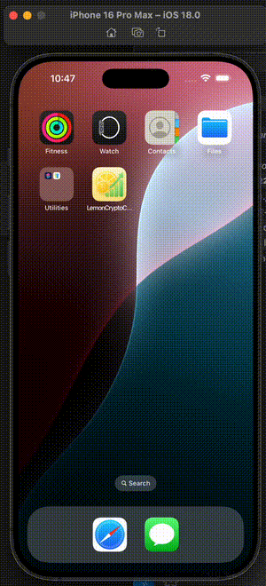
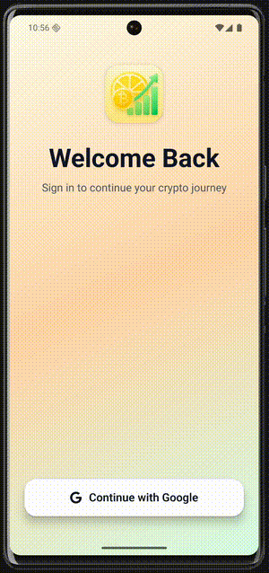

# LemonCryptoChallenge

A cross-platform React Native app to track cryptocurrencies, built as a technical challenge showcasing modern development practices and clean architecture.

See [REQUIREMENTS.md](./docs/REQUIREMENTS.md) for full challenge requirements.

## Features

- View top 100 cryptocurrencies
- Real-time price & market data
- Search, filter & favorite coins
- Google Sign-In auth
- Cross-platform: iOS & Android

## Demo Videos

| iOS                         | Android                             |
| --------------------------- | ----------------------------------- |
|  |  |

## Architecture

- **Clean Architecture** with:

```
src/
├── components/     # Reusable UI components
├── screens/        # Screen components (presentation layer)
├── hooks/          # Custom React hooks (business logic)
├── store/          # State management (Zustand)
├── context/        # React Context for auth
├── navigation/     # Navigation configuration
├── theme/          # Design system and theming
├── types/          # TypeScript type definitions
├── utils/          # Utility functions
└── config/         # Configuration files
```

- **Atomic Design**, composition over inheritance, SRP
- Typed props interfaces

## Tech Stack

- **React Native 0.80.1**, **TypeScript 5.0.4**, **React 19.1.0**
- **Zustand**, **React Query**, **Encrypted Storage**, **Keychain**
- **React Navigation**, **Size Matters**, **Skeleton Placeholder**
- **Google Sign-In**, **Vector Icons**
- Tooling: ESLint, Prettier, Jest, React Native Testing Library

## Design System

- Color tokens, typography scale, spacing system
- Responsive with `react-native-size-matters`
- Safe area & platform-specific styling

## Key Features

- Real-time data from CoinMarketCap via React Query
- Persistent, secure favorites with optimistic UI
- Debounced search, fast filtering, `useMemo` optimizations
- Google Sign-In with secure token handling
- Deep linking, protected routes, type-safe navigation

## Testing

- Unit tests for components and utils
- Mocks for external libs

## Performance

- Virtualized lists via `@legendapp/list`
- Memoization, lazy loading, minimal re-renders
- Optimized assets and bundle size

## Security

- Encrypted storage, secure key/token handling
- Input validation, API key protection

## Getting Started

```bash
git clone <repo-url>
cd LemonCryptoChallenge
npm install
cd ios && pod install && cd ..
```

## Create env

```
GOOGLE_WEB_CLIENT_ID=
GOOGLE_IOS_CLIENT_ID=
CMC_API_KEY=
```

## Run the app

```
npm run ios      # iOS
npm run android  # Android
npm test         # Run tests
```
